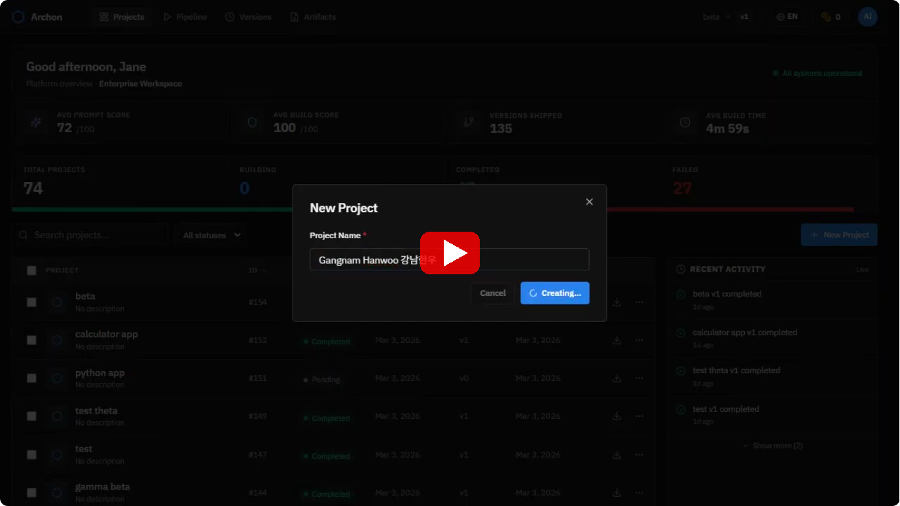
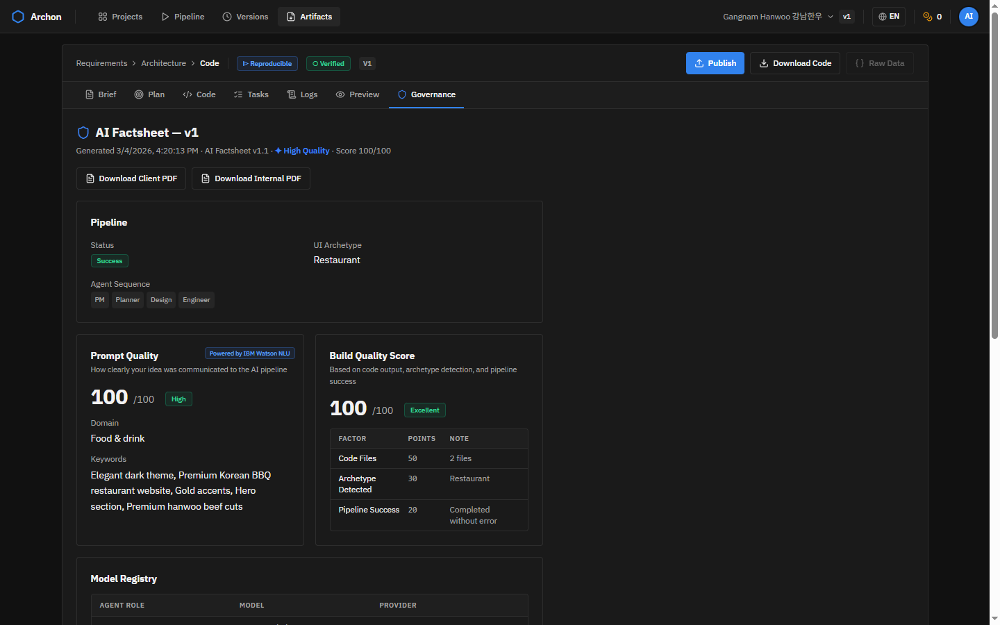
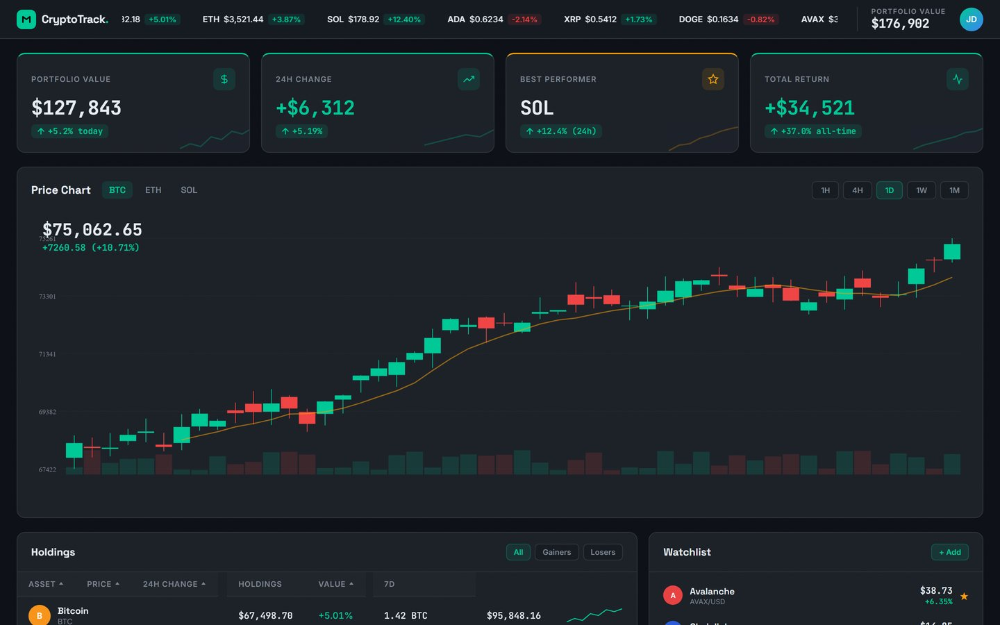
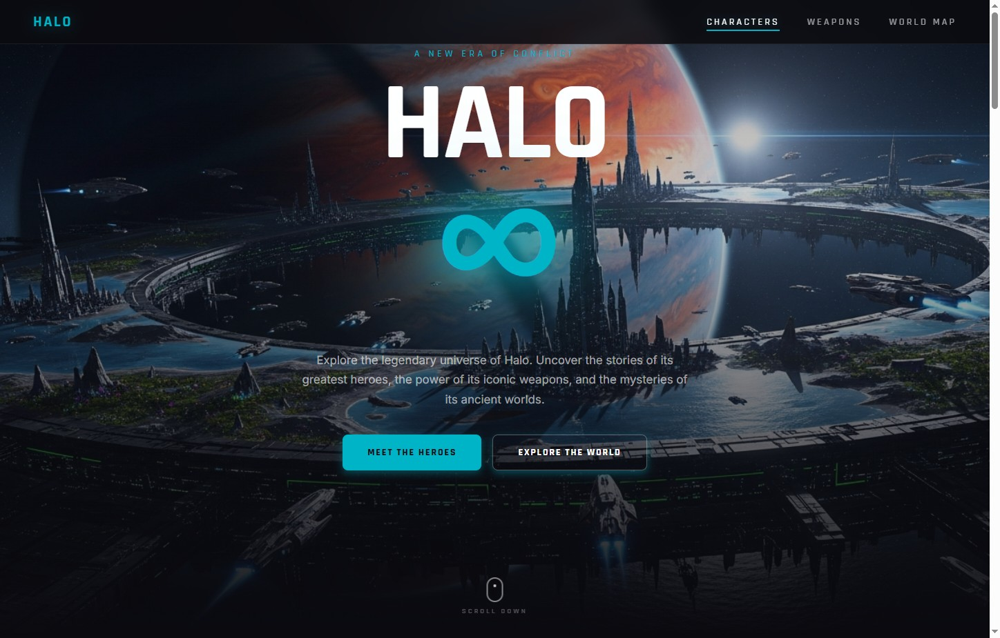
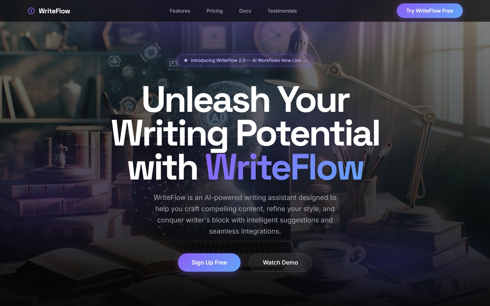
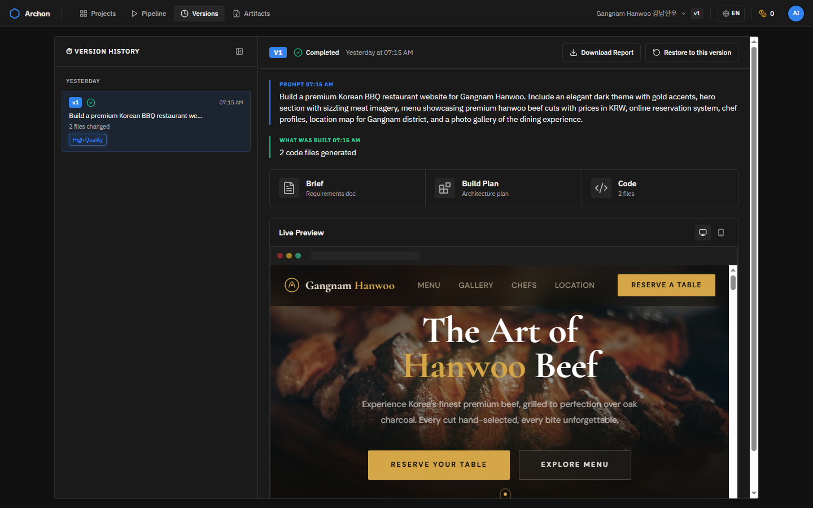
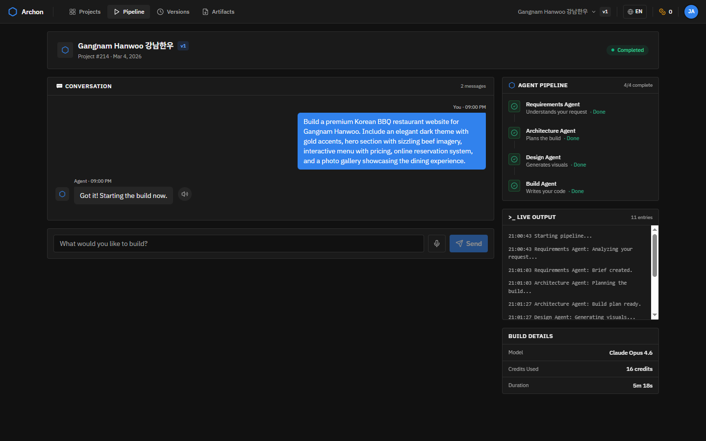
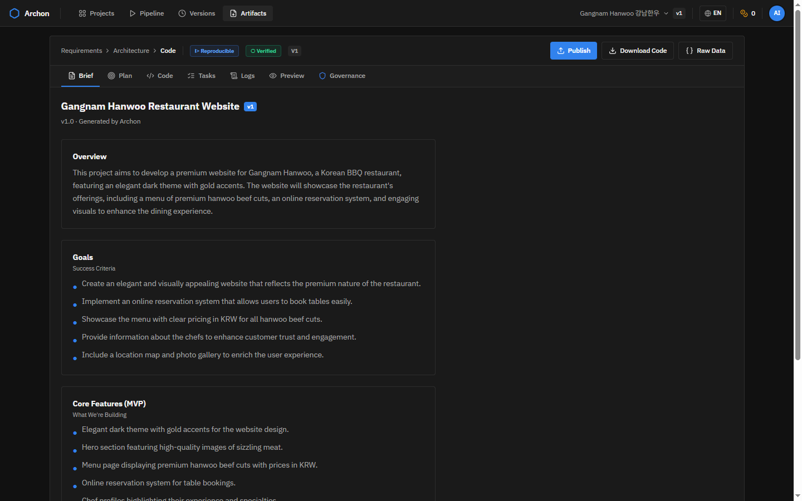

# Archon

> Open source under [Apache-2.0](LICENSE). Forks and pull requests are welcome.

Archon is a multi-agent application delivery platform that turns a prompt into a versioned execution with artifacts, live preview, evaluation, and governance surfaces. It is designed around traceability, recovery, scoring, and auditability rather than a single prompt-to-page interaction.

[Live Demo](https://archon.works) • [Video Walkthrough](https://youtu.be/ci8xDNnxJKQ) • [Showcase Gallery](docs/SHOWCASE_GALLERY.md)

## What Archon Demonstrates

- versioned artifact pipeline: brief, plan, code, preview, and factsheet per execution
- model-agnostic orchestration across Anthropic, Google, IBM, OpenAI, and local Ollama-backed workflows
- live version history with preview, restore, and prompt lineage
- runtime repair and build-recovery work for brittle generated React/TypeScript/Vite outputs
- automated eval loops with vision-based scoring and benchmark-driven iteration
- governance surface with model registry, quality scoring, and human-review gating

## Demo

[](https://youtu.be/ci8xDNnxJKQ)

> Walkthrough: prompt to generated app, version history, preview, and governed delivery flow.

## Standout Enterprise Surface

The governance / factsheet screen is one of the strongest product surfaces in the repo because it immediately communicates auditability, traceability, and enterprise delivery posture.

[](docs/screenshots/dashboard-governance.png)

What it shows:

- prompt quality scoring
- build confidence scoring
- model registry visibility across providers
- human-review gating
- a client-facing print/export surface

## Selected Generated Examples

These examples represent the strongest generated outputs currently included in the repository.

### Crypto Portfolio Dashboard
> Prompt: *"Build a crypto portfolio tracker with real-time prices, holdings table, and activity feed"*



### Halo Fan Page
> Prompt: *"Build a premium Halo fan page centered on Master Chief, Cortana, and the Arbiter. Include a cinematic hero, polished character dossiers, a legendary weapon showcase, and an explorable ringworld atlas."*

[](docs/screenshots/game-halo-20260316-full.jpg)

### SaaS Landing Page
> Prompt: *"Build a landing page for an AI-powered writing assistant with features, pricing, and testimonials"*

[](docs/screenshots/saas-writeflow-full.jpg)

More examples live in [docs/SHOWCASE_GALLERY.md](docs/SHOWCASE_GALLERY.md).

## Core Product Surfaces

### Versions And Live Preview

[](docs/screenshots/dashboard-versions.png)

This is the most differentiated surface in the repo: execution lineage, preview refresh, prompt history, and restore behavior in one place.

### Multi-Agent Pipeline

[](docs/screenshots/dashboard-pipeline.png)

The system persists the intermediate work, not just the final output.

### Artifact Viewer

[](docs/screenshots/dashboard-brief.png)

Artifacts remain visible and versioned, which makes the pipeline easier to inspect, review, and restore.

## Model-Agnostic Design

Archon is intentionally designed to route across providers rather than depend on a single model story.

- **Anthropic Claude** for premium code generation and showcase-quality runs
- **Google Gemini / Vertex AI** for planning, design direction, and image workflows
- **IBM Watson NLU** for governance, prompt analysis, and audit framing
- **OpenAI** in adjacent or legacy agent paths
- **Local Ollama** for lower-cost repeated evaluation and prompt-improvement loops

This design supports:

- provider abstraction
- premium vs economical routing
- cloud and local evaluation modes
- stable artifact/governance layers even as model choices change

## Operating Modes

The repo separates cheap repeated iteration from premium final demos:

- `bulk` profile for repeated eval and reliability work
- `showcase` profile for a small number of premium hero builds

```powershell
# Bulk reliability pass
python eval/eval_loop.py --config eval_config.json --profile bulk --archetype dashboard --runs 5 --skip-image-gen

# Premium showcase pass
$env:ENGINEER_MODEL = "claude"
$env:ENGINEER_CLAUDE_MODEL = "claude-opus-4-6"
$env:DESIGN_IMAGE_MODEL = "imagen-4.0-ultra-generate-001"
python eval/eval_loop.py --config eval_config.json --profile showcase --archetype game --runs 1
```

## Architecture

```text
User Prompt
  -> NLU / prompt analysis
  -> requirements artifact
  -> plan artifact
  -> design + image workflow
  -> code generation
  -> build / preview
  -> eval scoring
  -> governance factsheet
  -> version timeline + restorable execution
```

The result is a system where each run has visible lineage instead of a single opaque output.

## Quick Start

### Prerequisites

- Python 3.11+
- Node.js 18+
- API keys for the providers you want to enable

### Install

```bash
git clone https://github.com/aiedwardyi/archon
cd archon

# Python backend
python -m venv venv
source venv/bin/activate            # Windows (PowerShell): .\venv\Scripts\Activate
pip install -r backend/requirements.txt

# Frontends (each has its own node_modules)
(cd frontend         && npm install)
(cd frontend-studio  && npm install)
(cd frontend-consumer && npm install)
```

### Configure

Copy the example env file and add your keys:

```bash
cp backend/.env.example backend/.env
# then edit backend/.env and fill in at minimum:
#   JWT_SECRET_KEY        (generate: python -c "import secrets; print(secrets.token_urlsafe(32))")
#   ANTHROPIC_API_KEY     (for live code generation)
# GOOGLE_CLIENT_ID / Gemini / Watson keys are optional but unlock more surfaces.
```

For a dependency-free smoke test, set `OFFLINE_MODE=true` in `backend/.env` — the pipeline runs with built-in scaffolding instead of live model calls.

### Run

Each service needs its own terminal. Reactivate the venv in every new shell.

```bash
# Terminal 1 — backend (http://localhost:5000)
source venv/bin/activate            # Windows: .\venv\Scripts\Activate
python backend/app.py

# Terminal 2 — Studio UI        (http://localhost:3000)
cd frontend-studio && npm run dev

# Terminal 3 — Consumer UI      (http://localhost:3002)
cd frontend-consumer && npm run dev

# Terminal 4 — Enterprise UI    (http://localhost:8080)
cd frontend && npm run dev
```

## Public Demo Deployment

For a safe public portfolio deployment, build the frontend in static demo mode instead of exposing the live builder:

```powershell
cd frontend
$env:VITE_PUBLIC_DEMO_MODE = "true"
npm run build
```

The repo includes [amplify.yml](amplify.yml) for a frontend-only Amplify deployment that serves the read-only showcase page and keeps backend/model execution paths private.

## Further Reading

- [Engineering overview](docs/ENGINEERING_OVERVIEW.md)
- [Showcase gallery](docs/SHOWCASE_GALLERY.md)
- [Technical reference](docs/TECHNICAL_REFERENCE.md)
- [Roadmap](ROADMAP.md)


## License

Licensed under the Apache License, Version 2.0. See [LICENSE](LICENSE).
