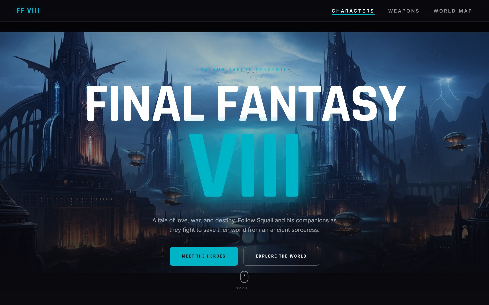
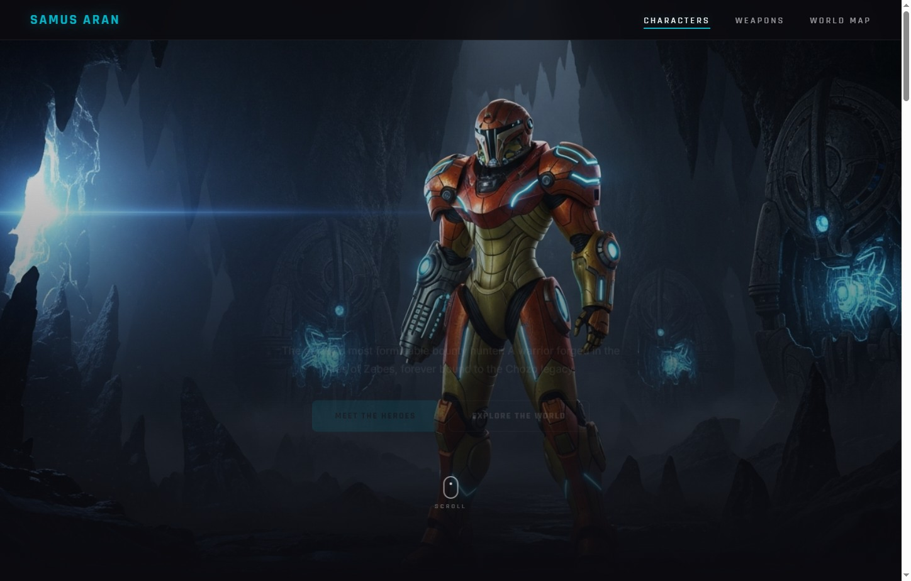
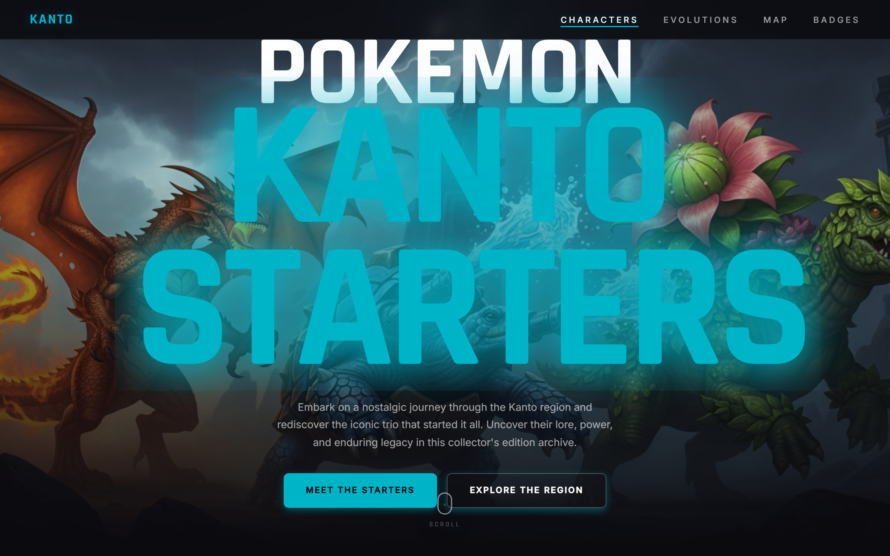
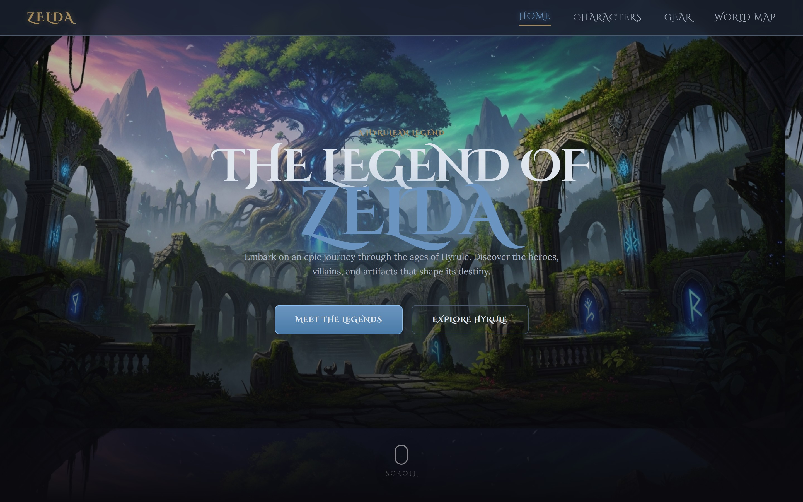
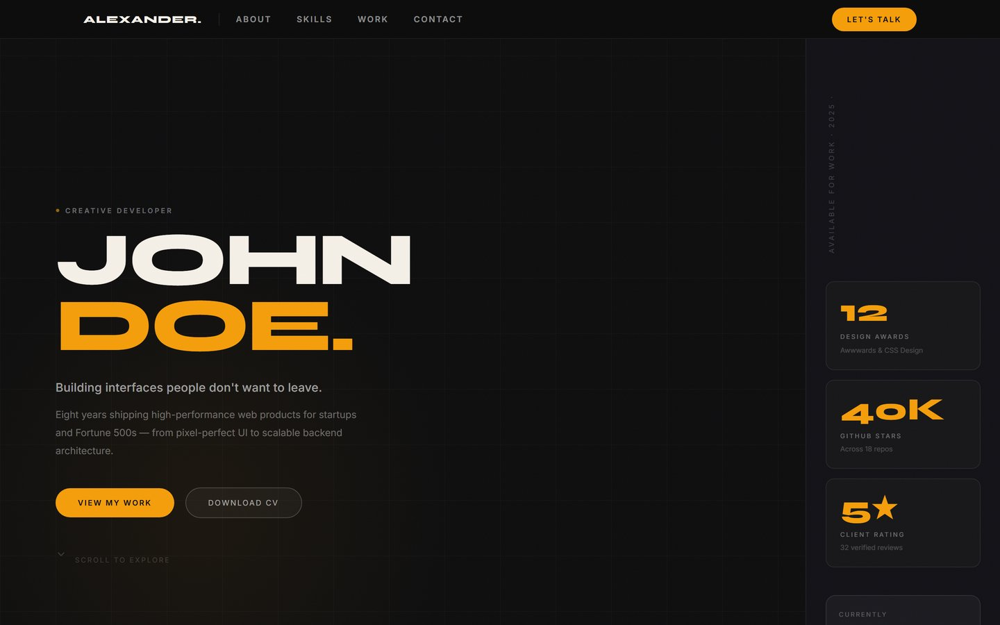
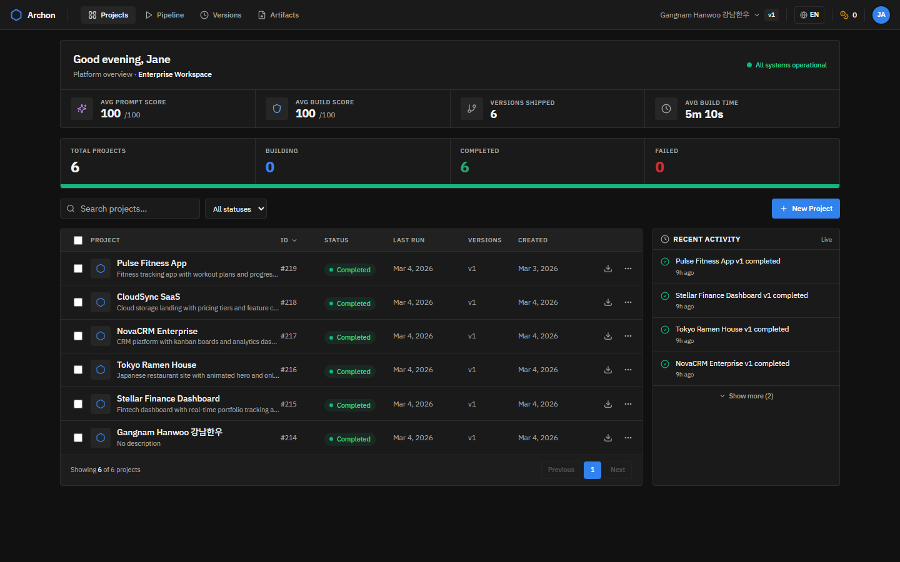
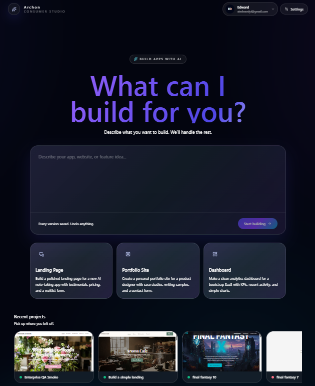

# Showcase Gallery

Additional generated examples that support the README but do not need to crowd the landing page.

## Final Fantasy VIII Fan Page

> Prompt: *"Build a Final Fantasy VIII fan page with character profiles, weapons gallery, and world map"*

## Metroid Fan Page

> Prompt: *"Build a premium Metroid fan page centered on Samus Aran. Include a cinematic hero, a polished dossier, a power suit showcase, and an explorable Zebes world map."*

## Pokemon Kanto Starters Fan Page

> Prompt: *"Build a premium Pokemon fan page centered on Charizard, Blastoise, and Venusaur. Include a cinematic hero, polished character dossiers, a full evolution showcase, a Kanto region map, and a gym badge collection."*

## Legend of Zelda Fan Page

> Prompt: *"Build a premium Legend of Zelda fan page centered on Link, Princess Zelda, and Ganondorf. Include a cinematic hero, polished character dossiers, a legendary gear showcase, and an explorable Hyrule world map."*

## Developer Portfolio

> Prompt: *"Build a creative developer portfolio with project showcase, skills section, and contact form"*

## Additional Product Screens

### Projects Dashboard

### AI-Generated Brief Artifact

### Consumer Prompt Interface

